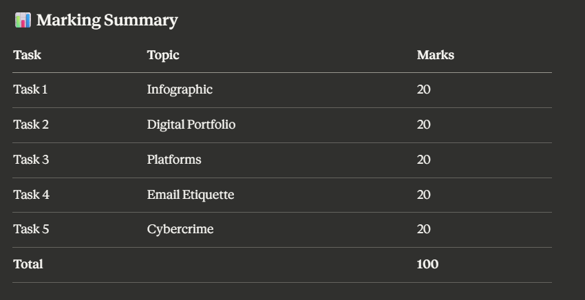

# 🌐 CSE0001 – Digital Literacy Portfolio  
VIT Bhopal University | VITyarthi E-Learning Platform  

## 👤 Student Details  
- **Name:** Akhil Pratap Singh  
- **Reg. No.:** 25BAI11206  
- **Branch:** B.Tech CSE (AI & ML)  
- **Year:** First Year B.Tech  
- **Course:** CSE0001 – Digital Literacy  
- **Date:** 27 March 2026  

---

## 📋 Project Overview  
This repository is my Digital Literacy Portfolio submitted as part of the CSE0001 course project. As a Student Digital Ambassador, I have completed five tasks covering digital literacy, professional online presence, coding platforms, email etiquette, and cybercrime awareness.

---

## 📁 digital-literacy-project/
├── README.md                          ← This file
├── report/
│   └── Project_Report.pdf             ← Full project report
├── task-1-presentation/
│   └── infographic.png                ← Infographic (Canva export)
├── task-2-portfolio/
│   ├── github.png                     ← GitHub profile screenshot
│   ├── linkedin.png                   ← LinkedIn profile screenshot
│   └── kaggle.png                     ← Kaggle profile screenshot
├── task-3-platforms/
│   ├── hackerrank.png                 ← Completed coding challenge proof
│   ├── google-form.png                ← Google Form screenshot
│   └── responses.png                  ← Google Sheet responses screenshot
├── task-4-email-etiquette/
│   ├── email.txt                      ← Two professional email drafts
│   └── social-media-checklist.md      ← Social media do's and don'ts
└── task-5-cybercrime/
    ├── casestudy.md                   ← UPI Fraud case study
    └── prevention-checklist.md        ← Stay Safe Online checklist

📌 Task Summaries
✅ Task 1 – Digital Literacy Awareness Infographic
Created a one-page visual infographic using Canva covering what digital literacy is, safe internet practices, useful digital tools for students, and professional online presence.
🔗 (01-infographic.png)

✅ Task 2 – Student Digital Portfolio 
Set up professional profiles on the following platforms:
PlatformProfile
Link GitHUB- https://github.com/akhilpratapsingh-dev
Link linkedin- https://www.linkedin.com/in/akhil-pratap-singh-87a833379/?skipRedirect=true
Link kaggle - https://www.kaggle.com/akhilpratapsinghh

✅ Task 3 – Coding & Collaboration Platforms 

Completed the "Solve Me First" challenge on HackerRank
Created a Digital Literacy Awareness Quiz Google Form with 5 questions

Google form link-

🔗 [https://docs.google.com/forms/d/e/1FAIpQLSfvR-ndVBQI8uLvJXKqsW7FT-uQhdtaPV54I77SH2JHPAZV1w/viewform?usp=preview]

✅ Task 4 – Professional Email & Etiquette Guide 

Drafted two professional emails and created a Social Media Do's and Don'ts checklist. See task-4-email-etiquette/ folder.

✅ Task 5 – Cybercrime Awareness 

Researched UPI/Online Payment Fraud as the cybercrime type. Wrote a detailed case study and created an 8-point prevention checklist for college students in India.

📊 Marking Summary

